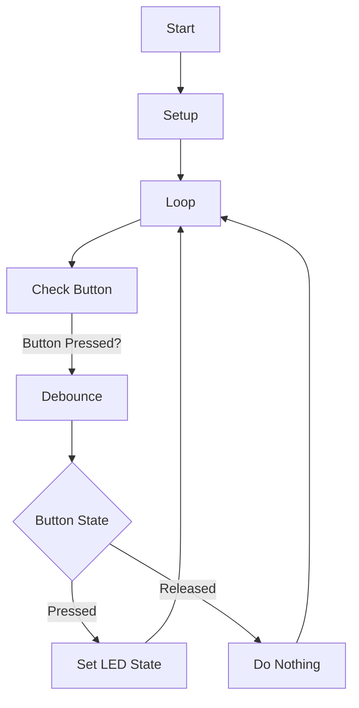

```mermaid
flowchart TD
    A[Start] --> B[Setup]
    B --> C[Loop]
    C --> D[Check Button]
    D -->|"Button Pressed?"| E[Debounce]
    E --> F{Button State}
    F -->|"Pressed"| G[Set LED State]
    F -->|"Released"| H[Do Nothing]
    H --> C
    G --> C
```